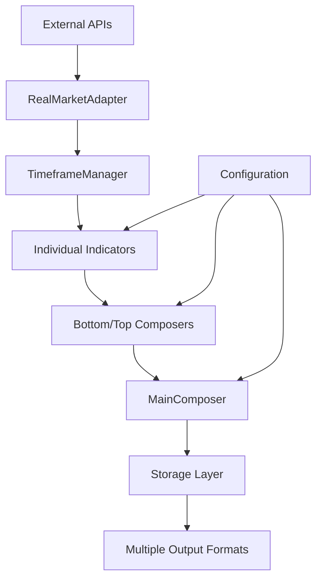

# Technical Architecture Documentation

## System Overview

The BTC Top-Bottom Indicators system is a modular, data-driven application that processes real-time and historical Bitcoin market data through 21 technical indicators to generate composite signals for market timing.

## Architecture Principles

### 1. Separation of Concerns
- **Data Layer**: Handles all external data fetching and caching
- **Processing Layer**: Indicator calculations and signal processing
- **Business Layer**: Score aggregation and interpretation
- **Persistence Layer**: Data storage and export functionality
- **Presentation Layer**: User interface and output formatting

### 2. Modularity
- Each indicator is an independent module
- Data adapters are interchangeable
- Configuration is externalized
- Easy to add/remove components

### 3. Fault Tolerance
- Multiple data source fallbacks
- Graceful degradation when services fail
- Comprehensive error handling and logging

## System Components

### Data Flow Architecture



### Core Components Detail

#### 1. Data Adapters (`src/data_adapters/`)

**RealMarketAdapter** (Primary)
- **Purpose**: Fetches real-time BTC price and historical OHLCV data
- **APIs**: CoinGecko (free/pro), Alpha Vantage, Finnhub
- **Features**: Rate limiting, fallback chain, caching
- **Key Methods**:
  - `get_current_btc_price()` - Current price with fallbacks
  - `get_btc_historical_data()` - OHLCV data for timeframes
  - `get_timeframe_data()` - Complete data + indicators for timeframe

**BitcoinMagazineScraper**
- **Purpose**: Web scraping for specialized metrics
- **Data**: CVDD, Terminal Price, NUPL
- **Implementation**: BeautifulSoup-based scraping

**YChartsScraper**
- **Purpose**: Bitcoin transaction fee data
- **Usage**: Transaction Cost indicator

#### 2. Timeframe Manager (`src/indicators/timeframe_manager.py`)

**Responsibilities**:
- Manages multi-timeframe data (M, W, 5D, 3D, D)
- Implements caching layer (60-minute cache validity)
- Coordinates data refresh across all timeframes
- Provides unified interface for indicators

**Key Features**:
- Cache validation and invalidation
- Parallel data fetching
- Error handling and retry logic
- Performance monitoring

#### 3. Indicator System (`src/indicators/`)

**Base Architecture**:
```python
class BaseIndicator:
    def __init__(self, config_manager, timeframe_manager, indicator_type)
    def calculate_raw_value() -> Optional[float]  # Abstract
    def get_indicator_name() -> str  # Abstract
    def get_normalized_value() -> Optional[float]
    def get_weighted_score() -> Optional[float]
```

**Bottom Indicators** (`src/indicators/bottom/`):
1. `CVDDTerminalRelativeIndicator` - Valuation extremes
2. `TimedBottomScoreIndicator` - Time-weighted composite
3. `VolumeBurst2DIndicator` - Short-term volume spikes
4. `CMVixFixIndicator` - Volatility-based oversold conditions
5. `GaussianChannelIndicator` - Price position analysis
6. `MMD3DIndicator` - Multi-timeframe momentum
7. `HashRibbonsIndicator` - Miner capitulation signals
8. `WavefrontIndicator` - 5-oscillator composite
9. `SuperTrendIndicator` - ATR-based trend filter
10. `PiCycleLowIndicator` - Moving average crossovers
11. `PuellMultipleIndicator` - Miner revenue analysis

**Top Indicators** (`src/indicators/top/`):
1. `CVDDTerminalRelativeIndicator` - Valuation extremes
2. `TimedTopScoreIndicator` - Time-weighted composite
3. `Volume3DIndicator` - Multi-horizon volume analysis
4. `BBWPIndicator` - Bollinger Band Width Percentile
5. `MMDIndicator` - Market momentum deterioration
6. `FundingRatesIndicator` - Derivatives sentiment
7. `NUPLIndicator` - Net Unrealized Profit/Loss
8. `WaveTrendOscillatorIndicator` - Momentum oscillator
9. `TransactionCostIndicator` - Network fee analysis
10. `PiCycleIndicator` - Moving average top signals

#### 4. Composition Layer (`src/composer/`)

**MainComposer**
- **Role**: Orchestrates entire calculation process
- **Responsibilities**:
  - Data refresh coordination
  - Bottom/Top composer execution
  - Market context gathering
  - Result aggregation and formatting
  - Performance monitoring

**BottomComposer** / **TopComposer**
- **Role**: Aggregate individual indicators into composite scores
- **Process**:
  1. Execute all relevant indicators
  2. Normalize values using bounds.json
  3. Apply weights from weights.json
  4. Calculate weighted average
  5. Generate interpretation

#### 5. Configuration System (`src/config/`)

**ConfigManager**
- **Purpose**: Centralized configuration management
- **Files**:
  - `weights.json` - Indicator importance weights
  - `bounds.json` - Normalization ranges
  - `data_sources.json` - API endpoints and settings

**Weight System**:
```json
{
  "bottom_indicators": {
    "puell_multiple": 16,     // Highest weight
    "m_timed_bottom_score": 15,
    "hash_ribbons": 14,
    // ... lower weights
    "pi_cycle_low": 6         // Lowest weight
  }
}
```

**Bounds System**:
```json
{
  "bottom_bounds": {
    "puell_multiple": {"lower": 0.1, "upper": 2.0},
    "cm_vix_fix": {"lower": 0.0, "upper": 100.0}
  }
}
```

#### 6. Storage Layer (`src/storage/`)

**IndicatorDatabase**
- **Technology**: SQLite
- **Schema**: Calculation results with timestamps
- **Features**: Automatic cleanup, performance stats

**FileLogger**
- **Formats**: JSON, CSV, Excel
- **Organization**: Timestamped files, historical append
- **Features**: Comprehensive export with metadata

## Data Model

### Core Data Structures

**Timeframe Data**:
```python
{
    'ohlcv': DataFrame,        # OHLC + Volume
    'indicators': {            # Technical indicators
        'rsi': Series,
        'macd': Series,
        'bollinger_bands': Dict[str, Series]
    },
    'timeframe': str,          # 'M', 'W', '5D', '3D', 'D'
    'symbol': str,             # 'BTCUSD'
    'last_update': datetime
}
```

**Calculation Results**:
```python
{
    'calculation_info': {
        'start_time': datetime,
        'end_time': datetime,
        'duration_seconds': float,
        'data_refreshed': bool
    },
    'bottom_analysis': {
        'composite_score': float,      # 0.0 - 1.0
        'individual_scores': Dict,     # Each indicator result
        'interpretation': {
            'strength': str,           # 'Very Strong', 'Strong', etc.
            'description': str,        # Human-readable signal
            'confidence': float
        }
    },
    'top_analysis': { /* similar structure */ },
    'market_context': {
        'current_btc_price': float,
        'price_statistics': Dict,
        'volume_statistics': Dict
    }
}
```

## Configuration Management

### Environment Variables (.env)
```bash
# Market Data APIs
ALPHA_VANTAGE_API_KEY=VN39LCM9M6AU7B4M
COINGECKO_PRO_API_KEY=CG-aY1xBfK3wVo5qZzuaKcSunjt
FINNHUB_API_KEY=68bf16494c91a2.46574769

# Additional APIs
POLYGON_API_KEY=MfpkBBaaIsKABEjRLnIjZurKdoeIkVlv
CHART_IMG_API_KEY=4y1yDH5UZmnYGGYq960lwCfUpmgKB2aM8tyOMG30

# TradingView Access
TRADINGVIEW_USERNAME=szopen40
TRADINGVIEW_PASSWORD=bobik13030

# Notification Systems
TELEGRAM_BOT_TOKEN=8217120679:AAFdsqB4yslDwqANuiJ4M647EHfrhxzhvL0
TELEGRAM_CHAT_ID=636594778
```

### Dynamic Configuration
- **Weights**: Adjustable via `weights.json`
- **Bounds**: Tunable via `bounds.json`
- **Data Sources**: Configurable via `data_sources.json`

## Performance Characteristics

### Timing Benchmarks
- **Full Calculation**: ~64 seconds (with rate limiting)
- **Data Fetching**: ~45 seconds (5 timeframes × 9 seconds each)
- **Indicator Processing**: ~15 seconds (21 indicators)
- **Storage/Export**: ~4 seconds

### Memory Usage
- **Base Application**: ~50MB
- **Data Cache**: ~20MB (5 timeframes × 300 bars each)
- **Peak Usage**: ~100MB during calculations

### Rate Limiting
- **Alpha Vantage**: 5 calls/minute (12-second delays)
- **CoinGecko Free**: 50 calls/minute (1.2-second delays)
- **CoinGecko Pro**: 500 calls/minute (0.12-second delays)

## Error Handling Strategy

### API Failures
1. **Primary Source Fails**: Automatic fallback to secondary
2. **All Sources Fail**: Use cached data if available
3. **No Data Available**: Generate realistic sample data

### Calculation Errors
1. **Individual Indicator Fails**: Skip indicator, continue with others
2. **Timeframe Data Missing**: Use available timeframes
3. **Critical Error**: Return error status with partial results

### Recovery Mechanisms
- **Exponential Backoff**: For temporary API failures
- **Circuit Breaker**: Disable failing services temporarily
- **Graceful Degradation**: Provide best-effort results

## Security Considerations

### API Key Management
- **Environment Variables**: Never commit to repository
- **Key Rotation**: Regular rotation of API keys
- **Access Control**: Minimal necessary permissions

### Data Validation
- **Input Sanitization**: All external data validated
- **Type Checking**: Strict type validation throughout
- **Range Validation**: Bounds checking for all calculations

### Logging Security
- **No Sensitive Data**: API keys never logged
- **Sanitized Outputs**: Remove personal information
- **Access Logs**: Track who accesses what data

## Scalability Design

### Horizontal Scaling
- **Stateless Design**: No shared state between instances
- **Load Balancing**: Multiple instances can run in parallel
- **Database Sharding**: SQLite can be replaced with distributed DB

### Vertical Scaling
- **Async Processing**: Convert API calls to async/await
- **Parallel Execution**: Process indicators concurrently
- **Memory Optimization**: Streaming data processing

### Caching Strategy
- **Local Cache**: In-memory caching for frequently accessed data
- **Distributed Cache**: Redis for multi-instance deployments
- **CDN**: Static content delivery for web interface

## Testing Strategy

### Unit Tests
- **Individual Indicators**: Test calculation logic
- **Data Adapters**: Mock API responses
- **Configuration**: Validate JSON schemas

### Integration Tests
- **API Integration**: Test with real APIs (rate limited)
- **End-to-End**: Full calculation workflows
- **Performance**: Timing and memory benchmarks

### Testing Tools
- **pytest**: Primary testing framework
- **mock**: API response mocking
- **coverage**: Code coverage analysis
- **pytest-benchmark**: Performance testing

## Deployment Architecture

### Current (Local Development)
```
Local Machine
├── Python Application
├── SQLite Database
├── File System Storage
└── Manual Execution
```

### Future (Cloud Deployment)
```
Cloud Infrastructure
├── Application Servers (Docker containers)
├── Database (PostgreSQL/MongoDB)
├── Cache Layer (Redis)
├── Message Queue (RabbitMQ/Kafka)
├── Load Balancer
├── Monitoring (Prometheus/Grafana)
└── CI/CD Pipeline (GitHub Actions)
```

## API Design (Future)

### RESTful Endpoints
```
GET  /api/v1/signals/current     # Latest signals
GET  /api/v1/signals/history     # Historical signals
GET  /api/v1/indicators          # Individual indicators
POST /api/v1/calculate           # Trigger calculation
GET  /api/v1/status              # System health
```

### WebSocket Events
```
signal_update        # New calculation results
price_update         # Real-time price changes
system_status        # Health notifications
```

## Monitoring & Observability

### Metrics to Track
- **API Response Times**: Per endpoint performance
- **Error Rates**: API failures and application errors
- **Calculation Accuracy**: Signal hit rates
- **System Resources**: CPU, memory, disk usage

### Logging Strategy
- **Structured Logging**: JSON format for easy parsing
- **Log Levels**: DEBUG, INFO, WARNING, ERROR, CRITICAL
- **Log Rotation**: Prevent disk space issues
- **Centralized Logging**: ELK stack for production

### Alerting
- **Critical Errors**: Immediate notification
- **Performance Degradation**: Threshold-based alerts
- **API Failures**: Service unavailability alerts
- **Anomaly Detection**: Unusual signal patterns

---

**Last Updated**: 2025-09-21 22:05 UTC+1
**Version**: 1.0.0
**Status**: Production Ready - Real Data Integration Complete